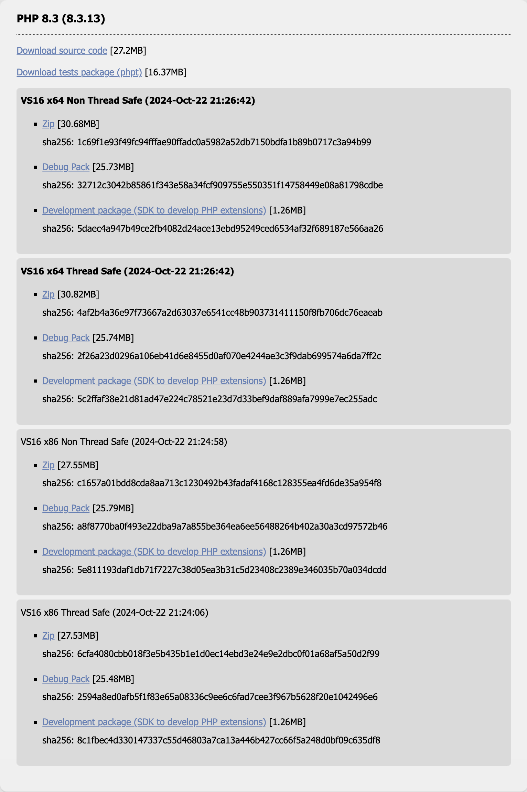
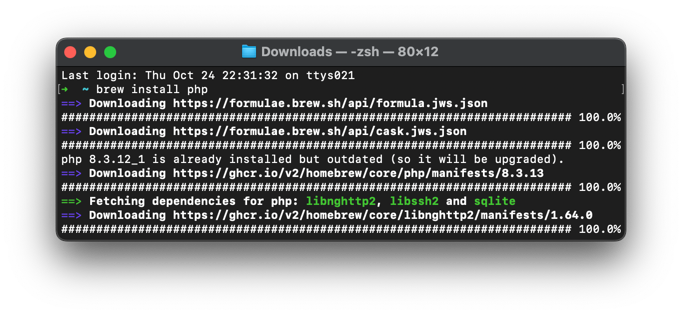

# How to install and use this software

A more detailed description of how to set up the tool from scratch.

## Software dependencies

This tool requires other software to run on your computer.

The following sections explain what those are and how to install them.

### `curl` on Windows

> command line tool and library for transferring data with URLs (since 1998)

If you would like to make use of the reopen script on windows, you should make sure that `curl` is available on your system.

If not, you can grab a version here: https://curl.se/windows/

### PHP Interpreter

> A popular general-purpose scripting language

This tool is written in PHP, so it can only be used by running PHP.

PHP is installed in different ways depending on your operating system.

### PHP for Windows

For Windows, there's a website where you can download PHP as `.zip` file.

> https://windows.php.net/download/

There is no installer. You simply unzip it and place the resulting folder where you can find it again.

The download page can be quite overwhelming at first, but the choice is really simple:



Here the right link is the __`Zip`__ inside the box that says "*VS16 x64 Thread Safe*"
 (it's "*VS16 x86 Thread Safe*" when you have a 32 bit computer).

#### Direct download link

For your convenience, here's the direct download link to the latest version of PHP (at the time of writing this).

- **PHP 8.3** 64 bit (https://windows.php.net/downloads/releases/php-8.3.13-nts-Win32-vs16-x64.zip)
- **PHP 8.3** 32 bit (https://windows.php.net/downloads/releases/php-8.3.13-nts-Win32-vs16-x86.zip)

### PHP for Mac

On Mac, the easiest way of getting PHP installed on your device is through a tool called _[Homebrew](https://brew.sh/)_.

Install _Homebrew_ if not already installed. You can follow their [instructions on this site](https://brew.sh/).

Here's the direct link to their installer package (latest at the time of writing this).

> https://github.com/Homebrew/brew/releases/download/4.4.2/Homebrew-4.4.2.pkg

Once it's installed you can open a so-called "Terminal", and type in `brew install php`. There will be some text scrolling by.



This should give you the latest version of PHP available.

### PHP for Linux

If you're using linux/unix, you probably know how to use the package manager of your choice to install `php-cli`.

Make sure it is at least version `8.1`.

```bash
sudo apt install php-cli
# ...
```

There are several descriptions on the PHP installation docs:

> https://www.php.net/manual/en/install.unix.php

### Android Debug Bridge

There is another software required in order for this to work: __[ADB](https://en.wikipedia.org/wiki/Android_Debug_Bridge)__
 which is short for "_Android Debug Bridge_".

You can find the download links for your operating system here: https://developer.android.com/tools/releases/platform-tools#downloads

You will have to accept their license before downloading, but this is an official software package from the android developers.

### Composer Package Manager

This application also needs some functions to run properly.

To get those on your computer, download [composer](https://getcomposer.org/) from their website.

It's a `.phar` file. Please drop it to the root directory of `tab-transfer`.

#### Direct download link

Here's the direct download link to the file (the latest LTS - long term support - at the time of writing this):

> https://getcomposer.org/download/latest-2.2.x/composer.phar

## Preparing your environment

This is mainly required on Windows, because Mac and Linux (Unix) will likely have this done automatically by a package manager.

### Windows `%PATH%` variable

It may sound strange, but there are yet other conditions that have to be met for this to work.

Both, PHP and ADB should be available as part of the `PATH` variable. Sound's technical, but essentially this means
 a value that the computer knows by a certain name. The `PATH` is special, as it's a list of paths where the system
 looks for programs.

Here's a good explanation of how to set up a new path in there:

> https://stackoverflow.com/questions/20564514/adb-is-not-recognized-as-an-internal-or-external-command-operable-program-or/65880336#65880336

And these are the paths that have to be put in there:

1. Path to PHP folder
2. Path to ADB folder + `\bin`
3. Path to `curl` folder

## Preparing your phone

For the connection to be established, the USB debugging feature has to be activated on your phone in the developer options.

### Developer options and USB debugging

Here's [how to enable USB debugging on your device](https://developer.android.com/studio/debug/dev-options.html#Enable-debugging).

__Always deactivate USB debugging when you are done using it!__

### USB connection

Now is the time to attach your phone to the USB cable. Make sure it is connected and recognized by the computer.

Keep the display unlocked, as the connection might be influence by the screen state.

### Open Chrome app

The Chrome app has to be kept open for this to work properly. Otherwise the connection might be unstable.

## Running the script

At last, browse to the directory of `tab-transfer` and run the `tab-transfer` script.
 On Windows it's `.cmd`, on Mac and Linux it's `.sh`.

This will take you through the default process of copying tabs.
 It will create three new files:

- `tabs_YYYY-MM-DD.json`
- `tabs_YYYY-MM-DD-gist.md`
- `tabs_YYYY-MM-DD-reopen.cmd`
- `tabs_YYYY-MM-DD-reopen.sh`

The `YYYY-MM-DD` is a placeholder for today's date.

## The reopen script

The script to reopen all tabs will be output depending on your operating system.
 On Windows it's `tabs-reopen.cmd`, on Mac and Linux it's `tabs-reopen.sh`.

Now it's possible to execute that script, once you have:

1. Activated USB debugging on the other phone
2. Connected the other phone via USB
3. Opened the Chrome app
4. Run the script and see the tabs reopen
