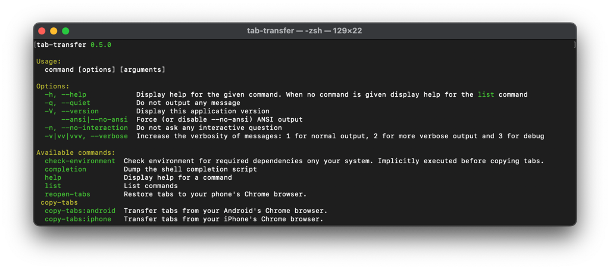
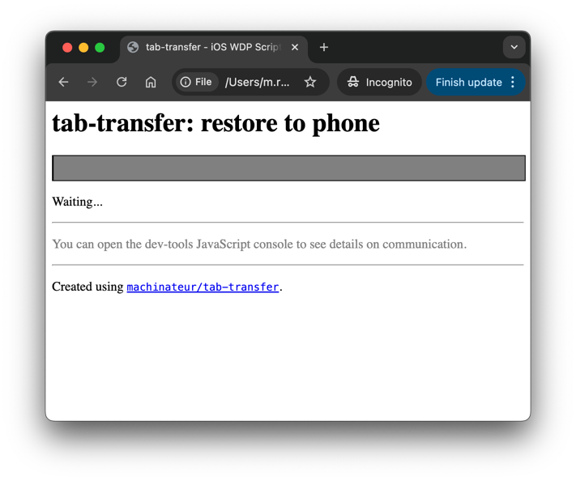

# tab-transfer

A tool to transfer Google Chrome tabs from your phone to your computer using developer tools.

This is the most reliable way to transfer large amounts of opened tabs when switching phones without boundaries.

- Copy all open tabs from Chrome on *Android* and *iOS* to your computer.
- Reopen exported tabs on your new *Android* or *iOS* phone from your computer.
- Completely cross-platform! Works on *Windows*, *Mac* and *Linux* computers!
- Also supports *Safari*!



> [Read the blog article with in-depth information about the inner workings of this tool.](https://machinateur.dev/blog/mobile-tab-hoarders-behold-the-ultimate-tab-transfer-tool)

## Requirements

- Chrome for Android
  - Should work with pretty much any more recent phone.
- Chrome for iOS
  - Before iOS `16.4`, only Safari was supported!

## Installation

This command line applications requires the following software to run:

- [Google Chrome Browser](https://play.google.com/store/apps/details?id=com.android.chrome) on your phone
- [PHP 8.1 or newer](https://www.php.net/downloads.php)
- [Android Debug Bridge](https://developer.android.com/studio/command-line/adb)
  (platform tools including the `adb` executable)
- [iOS WebKit Debug Proxy](https://github.com/google/ios-webkit-debug-proxy)

### Windows

Download the latest release installer from the [release](https://github.com/machinateur/android-chrome-tab-transfer/releases).
 The installer contains all required software dependencies to run on your system.

### Mac

On Mac, the easiest way of installing software dependencies is through [the Homebrew package manager](https://brew.sh/).
 Here's [how to get started](https://docs.brew.sh/Installation).

```bash
brew install php
brew install --cask android-platform-tools
brew install ios-webkit-debug-proxy
```

Then download the `.phar` file from the latest [release](https://github.com/machinateur/android-chrome-tab-transfer/releases).

Alternatively you can also check out the project source with Git, but that requires some more steps to install oftware libraries.

### Linux

```bash
sudo apt install php-cli
# ...
```

> Make sure it is at least PHP version `8.1`.

Refer to the [Download page at developer.android.com](https://developer.android.com/tools/releases/platform-tools) for
 installation instructions of the Android platform tooling.

You can find installation instructions for the [iOS WebKit Debug Proxy by Google over at  GitHub](https://github.com/google/ios-webkit-debug-proxy?tab=readme-ov-file#linux).

Then download the `.phar` file from the latest [release](https://github.com/machinateur/android-chrome-tab-transfer/releases).

Alternatively you can also check out the project source with Git, but that requires some more steps to install oftware libraries.

### Direct download links

Last updated: `November 3rd, 2024`.

#### PHP (Windows)

- **PHP 8.3** 64 bit (https://windows.php.net/downloads/releases/php-8.3.13-nts-Win32-vs16-x64.zip)
- **PHP 8.3** 32 bit (https://windows.php.net/downloads/releases/php-8.3.13-nts-Win32-vs16-x86.zip)

#### Homebrew (Mac)

- [Homebrew](https://github.com/Homebrew/brew/releases/download/4.4.2/Homebrew-4.4.2.pkg)

#### Android Platform Tools

- [Download page at developer.android.com](https://developer.android.com/tools/releases/platform-tools)

#### iOS WebKit Debug Proxy

- [iOS WebKit Debug Proxy GitHub Repository](https://github.com/google/ios-webkit-debug-proxy?tab=readme-ov-file)

## Usage

See [_which commands to use_](#which-command-to-use) for the commands.

On windows, when using the provided installer, you will have `copy-tabs-android.cmd` and `copy-tabs-iphone.cmd`
 as shortcuts to the commands. They will run with the default options applied.

### Prerequisites

- Here's [how to enable USB debugging on your Android device](https://developer.android.com/studio/debug/dev-options.html#Enable-debugging).
  - Enable developer options in settings.
  - Enable USB debugging option.
  - Restart the Chrome browser.
- Here's [how to enable USB debugging on your iOS device](https://developer.chrome.com/blog/debugging-chrome-on-ios/#getting_started).
  - Enable Safari WebInspector in settings.
  - Enable Chrome WebInspector in content settings.
  - Restart the Chrome/Safari browser.

Independent of your platform, **make sure to always disable USB debuggging after usage**!
 _It can be a security risk to you device, when in contact with public USB ports._

Also make sure to activate the usb debugging feature under developer options on your phone,
 as described in the [prerequisites above](#prerequisites) and to connect it to your computer.

The browser on your phone has to be running for this tool to work properly.
 Sometimes you have to re-connect the USB to get picked up properly.

### Phar

Open the installation directory of `tab-transfer` in a terminal or command prompt.

```bash
php tab-transfer.phar
```

You can always build the Phar from source, [as described down below](#building-phar-from-source).

### Which command to use

Dependeing on what phone you wish to transfer tabs from, you can choose between:

- `tab-transfer copy-tabs:android`
- `tab-transfer copy-tabs:iphone`

Both will produce output files named similar to the following:

- `tabs_YYYY-MM-DD.json`
- `tabs_YYYY-MM-DD-gist.md`

Then there is a command to reopen the tabs on another phone:

- `tab-transfer reopen-tabs`

See also [CLI synopsis](#cli-synopsis) for details on what arguments and options are supported.

### From source

#### On Windows:

Make sure to add the `adb` and `ios_webkit_debug_proxy` binary locations to the `PATH` environment variable.
Here's a good explanation for Windows, of how to set up a new path in there:

> https://stackoverflow.com/questions/20564514/adb-is-not-recognized-as-an-internal-or-external-command-operable-program-or/65880336#65880336

```bash
git clone git@github.com:machinateur/tab-transfer.git
cd tab-transfer
tab-transfer.cmd
```

This approach requires composer!

#### On Mac/Linux:

```bash
git clone git@github.com:machinateur/tab-transfer.git
cd tab-transfer
chmod +x ./tab-transfer.sh
./tab-transfer.sh
```

This approach requires composer!

#### Composer script

Alternatively, you can also run the command as composer script:

```bash
composer install --no-dev
composer run-script tab-transfer
```

## Credit and history

This tool was formerly known as `android-chrome-tab-transfer`.

The inspiration for this tool was [this android stackexchange answer](https://android.stackexchange.com/a/199496/363078).

Later on, I noticed that there was real demand for a tool that delivers seamless tab transfers,
 so I continued development. In 2024, with the release of version `0.5.0` and the rebranding to `tab-transfer`,
  iOS support was introduced.

## CLI synopsis

The following commands, arguments and options are available in the `tab-transfer` CLI:

```
tab-transfer 0.5.1

Usage:
  command [options] [arguments]

Options:
  -h, --help            Display help for the given command. When no command is given display help for the list command
  -q, --quiet           Do not output any message
  -V, --version         Display this application version
      --ansi|--no-ansi  Force (or disable --no-ansi) ANSI output
  -n, --no-interaction  Do not ask any interactive question
  -v|vv|vvv, --verbose  Increase the verbosity of messages: 1 for normal output, 2 for more verbose output and 3 for debug

Available commands:
  check-environment  Check environment for required dependencies ony your system. Implicitly executed before copying tabs.
  completion         Dump the shell completion script
  help               Display help for a command
  list               List commands
  reopen-tabs        Restore tabs to your phone's Chrome browser.
 copy-tabs
  copy-tabs:android  Transfer tabs from your Android's Chrome browser.
  copy-tabs:iphone   Transfer tabs from your iPhone's Chrome browser.
```

You can always view help information usinng `tab-transfer list`.

### Copy tabs from Android

```
Description:
  Transfer tabs from your Android's Chrome browser.

Usage:
  copy-tabs:android [options] [--] [<file>]

Arguments:
  file                   The relative filepath to write. The `--date` / `--no-date` flag applies as well. [default: "tabs.json"]

Options:
  -d, --date|--no-date   Whether to add the date `2024-11-03` suffix to the filename. Active by Default.
  -p, --port=PORT        The port to forward requests through `adb`. [default: 9222]
  -t, --timeout=TIMEOUT  The network timeout for the download request (at last 10 seconds). [default: 10]
      --skip-check       Skip the check for required dependencies ony your system will be performed.
  -s, --socket=SOCKET    The socket to forward requests using `adb`. [default: "chrome_devtools_remote"]
  -w, --wait=WAIT        The time to wait before starting the download request (between 0 and 60 seconds). [default: 2]
      --skip-cleanup     Skip the `adb` cleanup command execution. If active, no reopen script will be written.
  -h, --help             Display help for the given command. When no command is given display help for the list command
  -q, --quiet            Do not output any message
  -V, --version          Display this application version
      --ansi|--no-ansi   Force (or disable --no-ansi) ANSI output
  -n, --no-interaction   Do not ask any interactive question
  -v|vv|vvv, --verbose   Increase the verbosity of messages: 1 for normal output, 2 for more verbose output and 3 for debug
```

You can always view help information usinng `tab-transfer copy-tabs:android -h`.

### Copy tabs from iOS

```
Description:
  Transfer tabs from your iPhone's Chrome browser.

Usage:
  copy-tabs:iphone [options] [--] [<file>]

Arguments:
  file                   The relative filepath to write. The `--date` / `--no-date` flag applies as well. [default: "tabs.json"]

Options:
  -d, --date|--no-date   Whether to add the date `2024-11-03` suffix to the filename. Active by Default.
  -p, --port=PORT        The port to forward requests through `ios_webkit_debug_proxy`. [default: 9222]
  -t, --timeout=TIMEOUT  The network timeout for the download request (at last 10 seconds). [default: 10]
      --skip-check       Skip the check for required dependencies ony your system will be performed.
  -w, --wait=WAIT        The time to wait before starting the download request (between 0 and 60 seconds). [default: 2]
  -h, --help             Display help for the given command. When no command is given display help for the list command
  -q, --quiet            Do not output any message
  -V, --version          Display this application version
      --ansi|--no-ansi   Force (or disable --no-ansi) ANSI output
  -n, --no-interaction   Do not ask any interactive question
  -v|vv|vvv, --verbose   Increase the verbosity of messages: 1 for normal output, 2 for more verbose output and 3 for debug
```

You can always view help information usinng `tab-transfer copy-tabs:iphone -h`.

### Reopen tabs

```
Description:
  Restore tabs to your phone's Chrome browser.

Usage:
  reopen-tabs [options] [--] [<file>]

Arguments:
  file                   The relative filepath to read. The `--date` / `--no-date` flag applies as well. [default: "tabs.json"]

Options:
  -p, --port=PORT        The port to forward requests through. [default: 9222]
  -t, --timeout=TIMEOUT  The network timeout for the download request (at last 10 seconds). [default: 10]
      --skip-check       Skip the check for required dependencies ony your system will be performed.
  -i, --driver=DRIVER    The driver to use for restoration.
  -h, --help             Display help for the given command. When no command is given display help for the list command
  -q, --quiet            Do not output any message
  -V, --version          Display this application version
      --ansi|--no-ansi   Force (or disable --no-ansi) ANSI output
  -n, --no-interaction   Do not ask any interactive question
  -v|vv|vvv, --verbose   Increase the verbosity of messages: 1 for normal output, 2 for more verbose output and 3 for debug
```

You can always view help information usinng `tab-transfer reopen-tabs`.

This command also supports undocumented options,
 which correspond to the options available for the desired driver (`android` or `iphone`).
Additionally, the `--target-page` undocumented debug-parameter may be used to define a different startup target (iOS only).

## Technical details

The following technical details might be more interesting for technical users, who also wish to contribute or modify the tool.

### Environment check

Both drivers, *Android* and *iOS* will perform an environment check.
 You can also skip the check using the `--skip-check` option flag.

### Debug mode

In case of problems, please first try to solve those issues.

The commands provided in this CLI tool offer extensive debug output capabilities. Simply append the `-vv` (very verbose)
 or `-vvv` (debug) flags to the command.

### Android and Chrome Beta/Canary

It is totally possible to use the beta or canary version of Google Chrome.

On Android, you have to set a different value for the `--socket` option.

This is an advanced use-case. For details on how to use this tool with the beta or canary channels of the Google Chrome
 browser on Android, read [#2](https://github.com/machinateur/tab-transfer/issues/2).
Extended technical knowledge is advised.

On iOS, any WebKit WebView based browser is supported, where the targeted app depends on which is currently in the foreground.

### Safari on iOS

You can transfer tabs from and to safari and pretty much any browser that uses the iOS WebKit WebView.
 To do so simply open the desired app/browser instead of Google Chrome, in the steps described earlier.

### The reopen script

When transferring from Android, you will also get the reopen-script, depending on your operating system:

- `tabs_YYYY-MM-DD-reopen.cmd` on Windows
- `tabs_YYYY-MM-DD-reopen.sh` on Mac/Linux

It is only supported for backwards compatibility, because since `0.5.0` the `tab-transfer reopen-tabs` command is recommended.
This script requires `curl` to be available on the `PATH` env-var.

### How it works on Android

The `adb`, which is part of the Android platform tools, is used to forward http calls via the usb connection. What http
 calls, you ask? I present to you the [chrome devtools protocol](https://chromedevtools.github.io/devtools-protocol/).

> The Chrome DevTools Protocol allows for tools to instrument, inspect, debug and profile Chromium, Chrome and other
>  Blink-based browsers.

It exposes endpoints to retrieve all currently open tabs and also one to open a new tab. The former is used to download
 tab information, while the latter one can be used by the generated `sh` script to reopen the tabs on another device.

### How it works on iOS

While the principles remain the same, the tooling differs on iOS transfers. With iOS `16.4` expanded debugging capabilities
 were exposed for Google Chrome, which were previously limited to Safari only.

The [iOS WebKit Debug Proxy](https://github.com/google/ios-webkit-debug-proxy) translates _some_ of the protocol features
 of Apple's protocol (the [WebKit Inspector Protocol](https://github.com/WebKit/webkit/tree/main/Source/JavaScriptCore/inspector/protocol)).

More information on discrepancies between the protocols can be found
 in the [Chrome Dev-Tools section](https://github.com/google/ios-webkit-debug-proxy/tree/master?tab=readme-ov-file#chrome-devtools)
  of iOS WebKit Debug Proxy.

As the proxy program does not (yet) support the `/new` endpoint to create new targets (tabs), the iOS restoration relies
 directly on the WebKit Inspector's websocket. This is accomplished by abusing the browser's native websocket support
  to generate an ad-hoc inspector script that sends the correct inspector commands to the connected iPhone.



### Legacy command

You can still use that command in more or less unmodified greatness, if you like.
 By adding the `COMPATIBILITY_MODE=1` flag before calling the CLI tool, you can enable the command, named `copy-tabs`.

```
Description:
  A tool to transfer tabs from your android phone to your computer using `adb`. [Legacy]

Usage:
  copy-tabs [options] [--] [<file>]

Arguments:
  file                   The relative filepath to write. Only the filename is actually considered! [default: "tabs.json"]

Options:
  -d, --date|--no-date   Whether to add the date `2024-11-03` suffix to the filename. Active by Default.
  -p, --port=PORT        The port to forward requests using `adb`. [default: 9222]
  -s, --socket=SOCKET    The socket to forward requests using `adb`. [default: "chrome_devtools_remote"]
  -t, --timeout=TIMEOUT  The network timeout for the download request (at least 10 seconds). [default: 10]
  -w, --wait=WAIT        The time to wait before starting the download request (between 0 and 60 seconds). [default: 2]
      --skip-cleanup     Skip the `adb` cleanup command execution.
  -h, --help             Display help for the given command. When no command is given display help for the list command
  -q, --quiet            Do not output any message
  -V, --version          Display this application version
      --ansi|--no-ansi   Force (or disable --no-ansi) ANSI output
  -n, --no-interaction   Do not ask any interactive question
  -v|vv|vvv, --verbose   Increase the verbosity of messages: 1 for normal output, 2 for more verbose output and 3 for debug
```

### Legacy docs

The following is documentation for the legacy command, that was compatible with Android only.

#### Legacy: About the re-open script

To reopen the tabs on another device, connect it instead, allow usb debugging and start the google chrome browser. Then
 run the generated script file. It requires `curl` to send the commands to reopen all tabs, as well as `adb`.
The generated script will include commands to manage the debug connection, so make sure your new phone is connected
 before running the shell script.

Please note, that in most cases there will be a dialog prompting you to allow the usb debugging access. It's advised you
 keep your phone unlocked during the process, to make sure the request doesn't time out.

The script to reopen all tabs will be output depending on your operating system.
 On Windows it's `tabs-reopen.cmd`, on Mac and Linux it's `tabs-reopen.sh`.

On Mac and Linux you will first have to make the script executable.

See [#18](https://github.com/machinateur/tab-transfer/issues/18) for more information on how to
 repurpose the re-open script for a windows use-case.

> This is supported without manual steps on all platforms in newer versions of this tool.
>  See [_The reopen script_ above](#the-reopen-script) for details.

### Detecting network errors

Time has shown that the communication between `adb` on the computer and the Android device attached via cable can cause
 errors or at least confusion. Thus, the possibility was introduced to get the error message and code of whatever
 occurred during downloading the tabs from the device. Since that information is rather technical and will only be
 needed in certain cases, it is only displayed when the download request fails and the command is run in debug mode.

The output of the curl request will also be set to verbose and print directly to `STDOUT`.

To run the command with debug verbosity, append `-vvv` to the end of the command:

```bash
php tab-transfer copy-tabs -vvv
```

Make sure to activate the usb debugging feature under developer options on your Android phone and to connect it to your
 computer. The browser has to be running for this tool to work properly. If you are not sure on how to set it
 up, [here is a guide](https://developer.chrome.com/docs/devtools/remote-debugging/) on how to remotely debug an Android
 phone.

It's possible to gain some more insight using the device inspection built into any chrome-based browser. For that,
 navigate to `chrome://inspect/#devices` in any chrome based browser, like for example google chrome, installed on your
 computer.

### Incomplete tab list

Even though it is rare, there have been cases where the tab list was missing a small number of tabs.
^
In most cases the list was complete when re-tried.

It was also reported in [#29](https://github.com/machinateur/tab-transfer/issues/29) that setting
 the `chrome://flags/#tab-group-parity-android` flag to **enabled**, this would also solve the issue.

### Tab order and groups

It is not guaranteed that the order of the tabs exported corresponds to the same order they were opened on your device.
It is also currently not possible to keep tab-group associations across devices. This is a technical limitation,
 as the endpoint does not provide those information.

## Development

Use [composer](https://getcomposer.org/) to pull in all library dependencies.

### Building phar from source

The phar can be built from source using [box](https://github.com/box-project/box). If you don't have it installed yet,
 you can by running the following command:

```bash
composer global require humbug/box
```

Please keep in mind that global composer dependencies are discouraged, you should use the box version that's included as
 a dev-dependency.

The configuration may be customized using a `box.json` file. To build, run the following command:

```bash
box compile
```

Or, to use the dev-dependency, as recommended:

```bash
composer install --dev
composer run-script box-compile
```

### Bundling the Windows installer

The setup uses Inno Setup Compiler 6, see `winsetup`.

> Note: Also might be interesting... https://ss64.com/nt/iexpress.html

## License

It's MIT.
